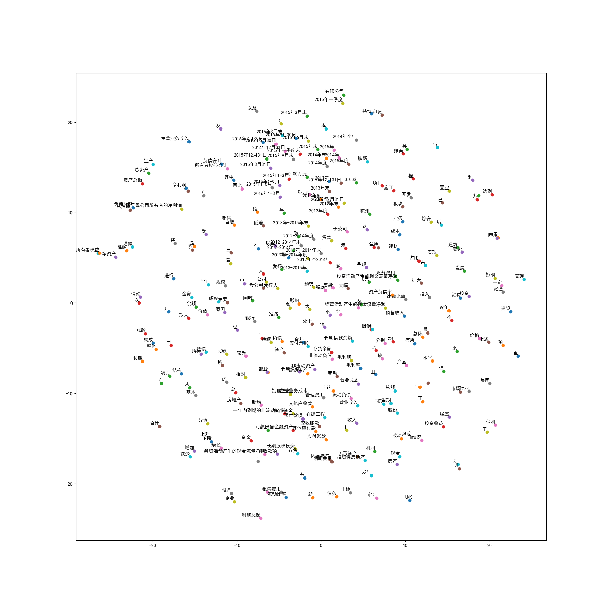

# AI-final-project
人工智能大作业三元组匹配

组长：张丽玮 组员：陈欲晓、陈淋、曾鸣

2018.1.7

show.py（陈欲晓）——提取测试数据并打出结果

data.txt——打出的结果，便于观察分析语法

simple_model.py（张丽玮）——最简易“分别”式语法模型结果比对

simple_out.txt——比对结果

（我们模型还没开始动，马上ddl了，数据库同天ddl同样没动，人生真是寂寞如雪）

2018.1.7

更新rule_model.py（张丽玮）——采用两条规则测试

rule demo.txt——对于规则的说明

rule_out.txt——比对结果

（感觉还没有上一个判断来得好，但是这样写的规则应该能更好地应用于RNN，恩，自我安慰）

（接下来就是去琢磨RNN了……I HAVE A DREAM）

2018.1.8

更新rule_model_v2.py（陈欲晓）——根据result去除所有冗余属性

rule_out.txt——比对结果，结果较好，sorted处理之后两条规则都100%匹配

接下来需要处理余下other部分，目前分析情况是”分句“类处理不当，会考虑添加这条判断之后再进行处理

目前模型的想法有两个：

1、 一个RNN去除冗余属性，之后导入规则，输出结果

2、 RNN去除冗余属性之后，再进行分类模型训练

第一种准确率需要两方都很高，需要细化RNN模型，完善规则（目前正在做的）

第二种容易出现冗余操作，多次训练的效率可能不高，但是提升准确率的可能性较高

（据说LFZ大佬纯规则自己写了规则训练器，准确率高达98%……技不如人，技不如人）

（接下来两天专心数据库，多线操作使人头秃）

2018.1.10

design ppt完成并上交

更新rule_model_v2.py（张丽玮）——增加分句规则判断

之前遗留的数据处理问题，在规则1、2正确率100%的情况下要提高余下情况的正确率

于是考虑分句句式——即长句由几个规则1、规则2的短句组成

结果出人意料的好，在测试集上可以达到全覆盖100%

rule_model_v3.py是没有去冗余的版本，可以直接用在RNN模型后

rule demo.txt更新，阐述了具体思路和结果

（加油我可以我能行……我能活下去！）

（明天还要人机交互汇报啊……啊……我的操作系统还没写）

2018.1.11

更新词嵌入模型（张丽玮）

word2vec_basic.py是官网上的参照基础模型

word2vec_tensorflow.py是我自己根据这个要求改的，可以生成tsne图，看训练情况

tsne.png是生成的结果

word2vec_training.py是直接调用了预训练的gensim库完成的结果

test_training.py是用来测试结果的

目前tensorflow训练结果应该还可以，看图可以得出。gensim生成图太密集（tsne_gensim.png)，单个测试测试了两个情况目前较好

（跑tensorflow我闻到了cpu的香味）

（上去展示老师反映非常好，甚至说可以发paper，我飘了……感谢各位大佬精准扶贫）

2018.1.21

更新晚了，最终版本提交

几个Model压缩文件都是在进行RNN调参过程中的中间结果（陈欲晓）

最后并没有使用我之前所写的词嵌入模型，而是直接用index输入将词嵌入和训练糅合起来了

Index处理为只有三元组和其他的分类，省去了很多冗余操作

最后一版是model_v3，里面写有最终提交的ppt和json文件

请务必看readme!不要在自己电脑上跑那个代码！

别问，问就是内存杀手cyx

（最终效果可达到准确率99%+，召回率98.5%，已经很漂亮了）

（圆满结束，安心放假啦）

